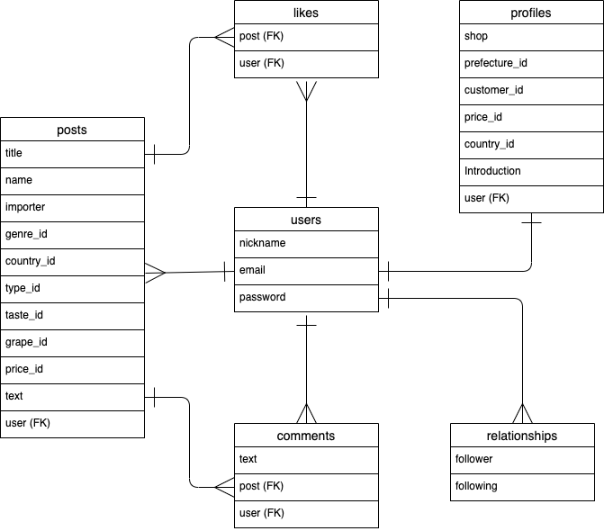
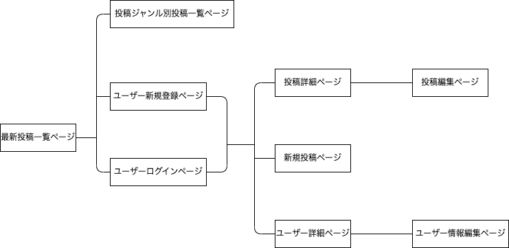

# アプリケーション名
WINE SHOP CLUB

# アプリケーション概要
ワイン小売業者間で「今売れてます」「次のシーズンに注力」「探してます」のジャンル別にワインの情報交換をすることができます。また、コメント機能、フォロー機能、いいね機能を通じてユーザー間でのコミュニケーションの推進が期待できます。

# URL
https://wineshopclub.onrender.com

# テスト用アカウント
- Basic認証パスワード： admin
- Basic認証ID： 2222 

（投稿済みユーザー）
- メールアドレス：aaa@aaa
- パスワード： abc123 

（未投稿ユーザー）
- メールアドレス：zzz@zzz
- パスワード: abc123

# 利用方法

## 商品投稿

1. ヘッダーの「会員登録」から、ユーザー新規登録を行う。登録済みユーザーはヘッダーの「ログイン」から、ログインをする 
2. ヘッダーの「新規投稿」から、投稿ジャンル、キャッチコピー、産地、タイプなどを入力し投稿する 

## ユーザー詳細（プロフィール）公開

1. ヘッダーから「マイページ」に遷移する 
2. 「ショップ情報の編集」ボタン（未登録の場合は「ショップ情報の登録」ボタン）から、ワインショップ情報（すべて任意）を入力し公開する

# アプリケーションを作成した背景
個人経営のワインショップ店主に課題をヒアリングし、顧客のニーズを反映した仕入れや販促の計画が難しいという課題を抱えていることが判明しました。課題を分析した結果、「店を空けられないため、試飲会や勉強会に行く時間がない」「同業者間でのつながりが生まれにくく、他店の動向が分からない」ということが影響していると仮説を立てました。ワイン小売業者は個人経営が多いため、同様の課題を抱えている方も多いと推測し、同業者間で商品情報について情報交換ができるアプリケーションを開発することにしました。

# 洗い出した要件
https://docs.google.com/spreadsheets/d/1HT9o-iy92YieDkNqAzhfQvkQo-8lnnCIhi6JXzf8rTc/edit#gid=1538567000

# 実装した機能についての画像・GIF

## トップページ・投稿ジャンル別投稿一覧ページ

- トップページは各投稿ジャンルの直近の投稿を３件ずつ表示
- 「すべて見る」もしくはトップページの「投稿ジャンル」から投稿ジャンル別投稿一覧ページに遷移する

## 投稿詳細ページ

- トップページもしくは投稿ジャンル別投稿一覧ページの「この投稿を見る」から投稿詳細ページに遷移する
- 「いいね」とコメントの登録と削除を非同期通信で反映する
- ログインユーザーが投稿者の場合、「投稿の編集」「削除」が行える

## ユーザー詳細(プロフィール)ページ

- トップページ・ヘッダーの「マイページ」からユーザー詳細ページに遷移する
- ワインショップ情報を登録し、公開する
- フォロー関係にあるユーザー一覧、「いいね」登録をした投稿一覧のリストが表示され、リストにあるニックネームもしくはキャッチコピーをクリックすると、該当するユーザーもしくは投稿の詳細ページに遷移する

# データベース設計

# 画面遷移図

# 開発環境
- フロントエンド
- バックエンド
- テスト
- テキストエディタ

# ローカルでの動作方法
以下のコマンドを順に実行 
％ git clone https://github.com/chicorycoffee/wineshopclub.git 
％ cd wineshopclub 
％ bundle install 
％ yarn install 

# テーブルとアソシエーション

## postsテーブル

| Column     | Type       | Options                        |
| ---------- | ---------- | ------------------------------ |
| title      | string     | null: false                    |
| name       | string     | null: false                    |
| importer   | string     |                                |
| genre_id   | integer    | null: false                    |
| country_id | integer    | null: false                    |
| type_id    | integer    | null: false                    |
| taste_id   | integer    |                                |
| grape_id   | integer    |                                |
| price_id   | integer    |                                |
| text       | text       |                                |
| user       | references | null: false, foreign_key: true |

### Association
- belongs_to :user
- has_one_attached :image
- has_many :comments, dependent: :destroy
- has_many :likes, dependent: :destroy

## usersテーブル
| Column   | Type   | Options                   |
| -------- | ------ | ------------------------- |
| nickname | string | null: false               |
| email    | string | null: false, unique: true |
| password | string | null: false               |

### Association
- has_many :posts, dependent: :destroy
- has_many :comments, dependent: :destroy
- has_many :active_relationships, class_name: 'Relationship' foreign_key: :following_id, dependent: :destroy
- has_many :followings, through: :active_relationships, source: :follower, dependent: :destroy
- has_many :passive_relationships, class_name: 'Relationship', foreign_key: :follower_id, dependent: :destroy
- has_many :followers, through: :passive_relationships, source: :following, dependent: :destroy
- has_many :likes, dependent: :destroy
- has_one :profile, dependent: :destroy

## commentsテーブル
| Column | Type       | Options                        |
| ------ | ---------- | ------------------------------ |
| text   | string     | null: false                    |
| post   | references | null: false, foreign_key: true |
| user   | references | null: false, foreign_key: true |

### Association
- belongs_to :post
- belongs_to :user

## profilesテーブル
| Column        | Type       | Options                        |
| ------------- | ---------- | ------------------------------ |
| shop          | string     |                                |
| prefecture_id | integer    |                                |
| customer_id   | integer    |                                |
| price_id      | integer    |                                |
| country_id    | integer    |                                |
| introduction  | text       |                                |
| user          | references | null: false, foreign_key: true |

### Association
- belongs_to :user

## relationshipsテーブル
| Column    | Type       | Options     |
| --------- | ---------- | ----------- |
| follower  | references |             |
| following | references |             |

### Association
- belongs_to :following, class_name: 'User'
- belongs_to :follower, class_name: 'User'

## likesテーブル
| Column | Type       | Options           |
| ------ | ---------- | ----------------- |
| post   | references | foreign_key: true |
| user   | references | foreign_key: true |

### Association
- belongs_to :post
- belongs_to :user
